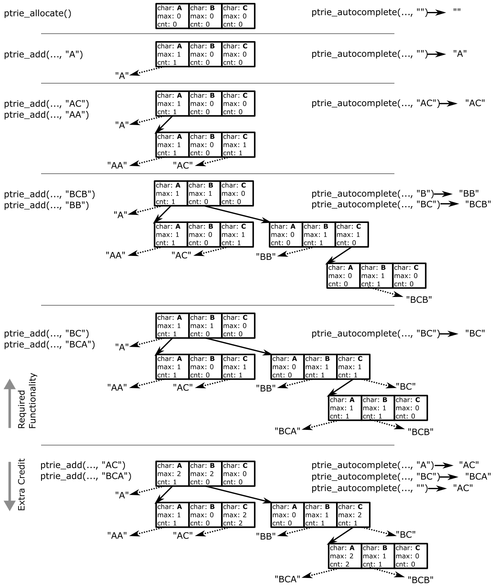

# Prefix Trie

Text prediction is common and quite useful.
A few examples:

- When typing on limited input devices like smartphones, word completion can speed up your typing.
- At the shell, typing `<tab>` asks the shell to perform autocompletion of commands, which enables you to speedily manipulate your system.
- Code editors often have complex support for completing function and variable names as you type them which not only speeds up your coding, but also enables you to avoid memorizing all names.

You'll implement the core data-structure, a **prefix trie**, that we'll use for each of these!
In addition to allocation and deallocation functions, we support two operations:

- `ptrie_add` to add a string into the prefix trie, and
- `ptrie_autocomplete` to ask for an autocompletion for a string from the strings that have been previously added.

See `ptrie.h` for a detailed description of the entire API.

A simple prefix trie is a lookup structure in which the cost of doing a lookup (either add or autocomplete), is $O(m)$ where $m$ is the *length of the string*.
A *prefix* of a string is the first $I$ characters for each $I$ less than or equal to the string's length.
For example, all prefixes of `ptrie` are `{p, pt, ptr, ptri, ptrie}`.
A path from the root of the prefix trie to an added string walks through nodes that represent an increasingly large prefix.
Thus, each node represents a character one index deeper into the string than that last node.
Each node also tracks counts of how many times each string has been `ptrie_add`ed, and the maximum count is tracked for a sub-trie to guide autocomplete to the most frequently added string/sub-trie that matches a prefix.
To get an intuitive understand of how the prefix trie works, check out the figure that walks through a sequence of `ptrie_add`s, and gives some examples of `ptrie_autocomplete` output.

You should focus on fully implementing and testing the required functionality first, then move on to the extra credit if you have time.

## Required Functionality

You will add a `ptrie.c` file, that will contain your implementation.
We will use *only* your `ptrie.c` in our test harness (that includes `ptrie.h` and the test files).

The objective of the required functionality is to implement prefix trie *without frequency tracking*.
As such, we'll focus on using the prefix trie only with `ptrie_add`s with strings that have not been previously `ptrie_add`ed to the data-structure.
Thus, you *do not need* to maintain the *count* or *maximum count* variables.
This significantly simplifies your implementation. 

There are 5 unit tests for the required functionality. 
You should write your solution incrementally, and use each unit test as a stepping stone to verify your solution before moving on to the next feature.

- `tests/01_add.c` - Test the allocation and freeing, then the addition of strings (but not the autocompletion).
- `tests/02_valid.c` - Simply check that after adding some strings, autocomplete queries return strings for which the query is a valid prefix.
    It does *not* check for the lexographic ordering.
- `tests/03_simple.c` - A set of tests that focus on testing some of the more straightforward queries using the example inputs from the visual example above.
- `tests/04_wordlist.c` - A test that runs on a wordlist of around 1000 words.
    We will test your code with a *separate* wordlist.
- `tests/05_conditions.c` - A test that attempts to focus on evaluating the difficult edge-cases.
    We won't provide all tests here for you, and you must add your own tests!

Each test is work one point for functional completion, and one point for also passing valgrind.
Your final points are scaled up to 100.
Passing the provided tests alone is not enough to guarantee credits.
Our tests will expand on tests `04` and `05`, so you *must* also expand them to include more interesting conditions.

## Extra Credit

For extra credit, you'll add the *count* and *maximum count* values to enable `ptrie_autocomplete` to return the autocompletion that is the most popular.

- `06_simple2.c` - The full example (including the required functionality inputs) from the image above.
- `07_wordlist.c` - A wordlist of around 1000 words augmented with redundant copies to generate multiple adds with the same string.
    Again, we will test with a different wordlist.
- `08_conditions.c` - A test that focuses on edge case conditions.
    We won't provide a complete set of tests here for you, and you must provide additional artisanal tests that test the edge-cases of your code.

Each test is worth one point for functional completion, and one point for also passing valgrind.
Our tests will expand on tests `07` and `08`, so you should also expand them to include more interesting conditions.

**You can earn up to 50% more on the HW by completing the extra credit.**

## Prefix Trie Details

A prefix trie has the following properties:

- A tree where each node in the tree contains an array of a fixed size, with an entry for each character in the alphabet^[Note, I don't mean an alphabet of "a-z" here, but instead the set of all character values that can be represented. This might include digits, and other non-letter values. In our case, we'll treat the alphabet as all values that can be represented by a character. Since a character is a single byte, or 8 bits, this is $2^8$ values which is $256$. Thus each node contains an array of 256 values, each corresponding to one of the possible character values. Note that you can use a character as an offset into an array in C.].
- At each node, we lookup the entry (in the node's array) corresponding to the *next* character in the string, generating a path of nodes that correspond to a prefix of each string in that sub-trie.
    In the figure, *next* is the solid arrows.
- Nodes at layer $N$ in the tree represent the $N$th character in the tracked strings.
    For example, layer $0$ tracks the character at offset $0$.
- Each entry in a node can represent a string, if the sequence of characters through the trie is exactly the sequence of characters in a string that has been `ptrie_add`ed.
    See the dashed arrows in the figure.
- An array entry for character $X$ in a node contains

    1. a *pointer to a string* or `NULL` whose characters match the path of characters taken through the prefix trie (e.g. its last character is $X$), if that string is stored in the structure;
    2. a *pointer to the next node* if the prefix trie stores strings of a longer length;
	3. a *count* of the number of times a string has been added to the structure if the string is equal to the path of nodes through the trie; and
    4. a *maximum count* of the number of times a string has been added of any string in this sub-trie.

	The string is used to find a stored string in the structure, and the count is used to track how many times that string was added to the structure.
	The pointer to the next node is used to walk down the trie, and the maximum count tracks the largest count of any string in the sub-trie.

Given this, `ptrie_add(..., str)` walks through the trie to find the node's entry that corresponds to `str`, and sets its string pointer to a copy of `str` if it isn't already set, and increments its count.
If the updated count is higher than the maximum count for the sub-trie, the maximum count must be updated from the root node to the `str`'s node.
This operation both sets a string to be tracked by the structure, and tracks the number of times it has been added to enable autocompletions to the more popular strings.
`ptrie_autocomplete(..., str)` will return a duplicate of the string whose prefix is `str` that has the highest count.
The maximum count variables in each entry, guide our walk through the trie to find the most popular string.
Should more than one string have identical counts, we'll always choose the one with the lexographically lowest value.
